# Blink LED (PC13)

Depois de configurar o ambiente e entender o papel do STM32CubeMX e da STM32CubeIDE, um dos primeiros testes mais importantes é fazer o LED piscar.

Esse exemplo é útil porque permite verificar se o projeto foi criado corretamente, se o pino foi configurado como saída digital e se o código está sendo gravado e executado na placa como esperado. O tutorial da Eletrogate usa esse fluxo com a Blue Pill, configurando o **PC13** como saída e inserindo o código do blink dentro do `while (1)`. 

---

## Objetivo

Neste exemplo, o pino **PC13** será configurado como saída digital para controlar o LED da placa.

Ao final, o programa fará o LED alternar entre ligado e desligado em um intervalo fixo.

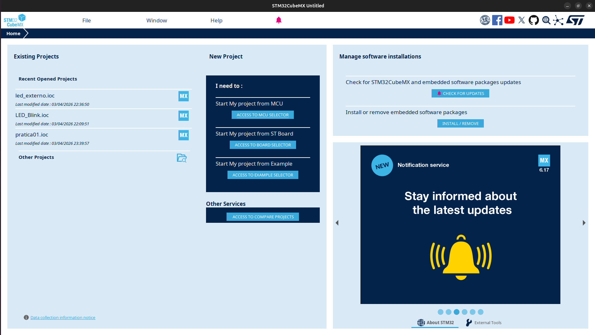

*Figura 1. Tela inicial da STM32CubeMX para criação de um novo projeto.*


---

## Configuração no STM32CubeMX

Antes de escrever o código, é necessário configurar o projeto.

---

### 1. Criar o projeto

Existem duas formas mais comuns de iniciar um projeto STM32:

**Opção 1: STM32CubeIDE com CubeMX integrado (versões 1.x.x)**

Na STM32CubeIDE, clique em:

File -> New -> STM32 Project

Em seguida, selecione o microcontrolador da placa e avance para a tela de configuração. O projeto foi iniciado buscando o alvo **STM32F103C6T6A** no seletor da IDE. 

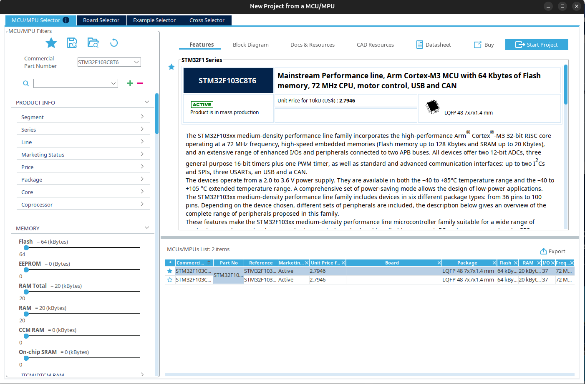

*Figura 2. Seleção do microcontrolador ou da placa no assistente de criação do projeto.*

**Opção 2: STM32CubeMX separado**

Se estiver usando o CubeMX separado da IDE:

1. Abra o STM32CubeMX
2. Clique em Access to MCU Selector

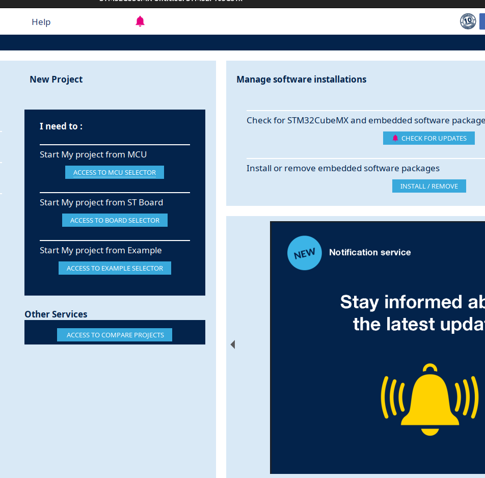

3. Escolha o microcontrolador desejado


Nos dois casos, ao final você chegará na mesma tela de configuração de pinos, clocks e periféricos.

---
### 2. Configurar o sistema

Na seção **System core**, vá ate **SYS** defina:

* **Debug** como `Serial Wire`
* **Timebase Source** como `SysTick`


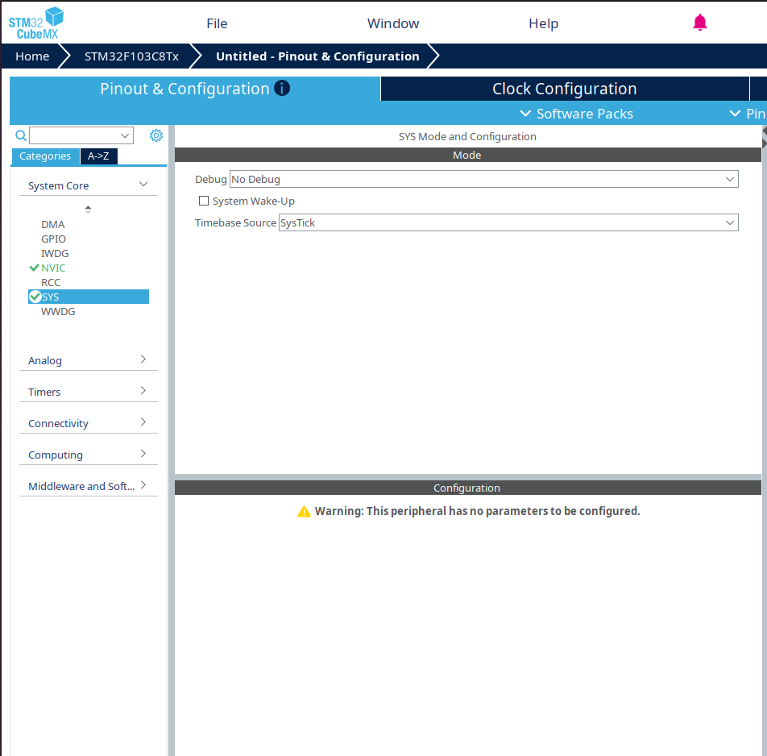

*Figura 3. Configuração da seção SYS com Serial Wire e SysTick.*

---

### 3. Configurar o clock

Na seção **RCC** ainda em **System core** , selecione:

* **High Speed Clock (HSE)** como `Crystal/Ceramic Resonator`

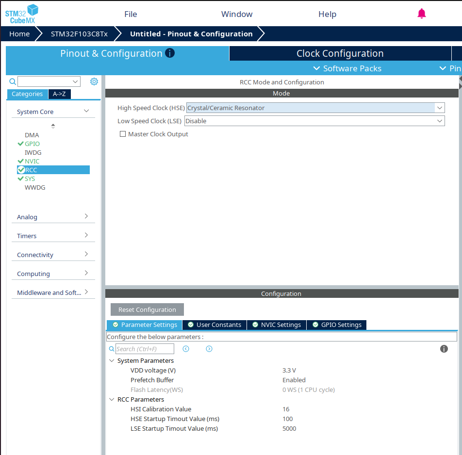


---

### 4. Configurar o pino PC13

No campo **Pinout View**, clique no pino **PC13** e selecione a função **GPIO_Output** para configurá-lo como saída digital.

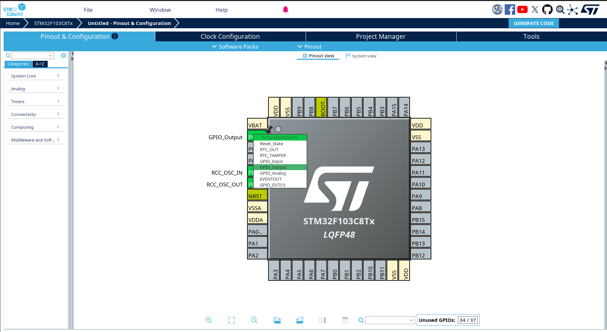

*Figura 5. Configuração do pino PC13 como saída digital.*

Em seguida, clique, sobre o mesmo pino, com o botão direito do mouse, fazendo com que seja exibido o respectivo menu. Neste, clique em “Enter User Label”.

No campo agora aberto, digite “pinoLED”.

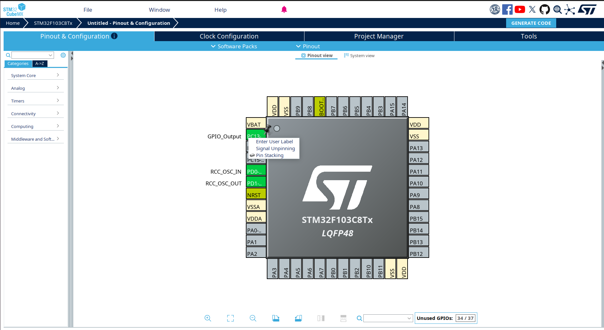

---

### 5. Clock Configuration

Depois, na aba **Clock Configuration**, ajuste a fonte do PLL e o clock do sistema. O fluxo usa **HSE** como fonte do PLL e **PLLCLK** como clock do sistema. 

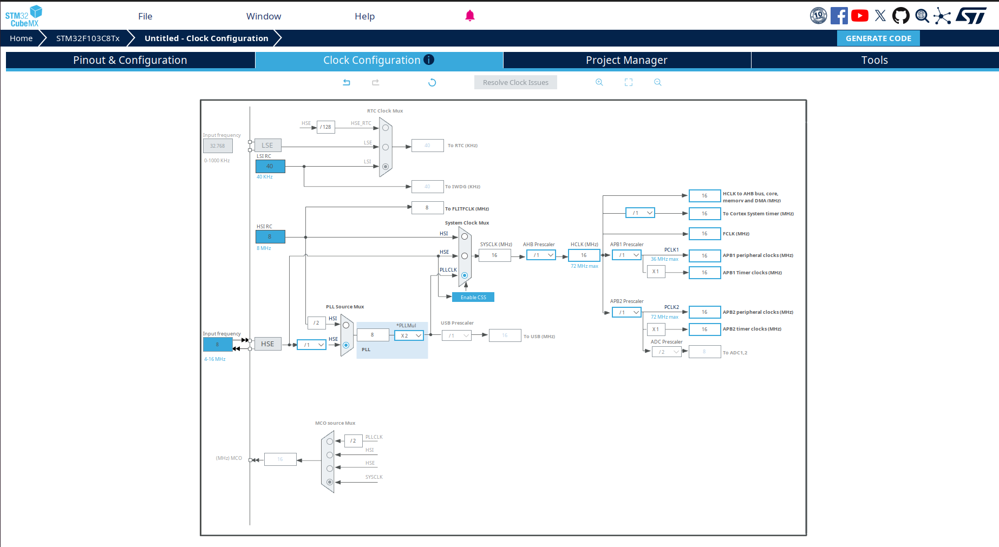

*Figura 4. Ajuste do clock do sistema na aba Clock Configuration.*

---

### 6. Gerar o código

Depois de concluir as configurações, salve o projeto para gerar automaticamente os arquivos. Tecle “Ctrl+S”, para salvar as configurações. Isso fará surgir uma janela questionando se o código correspondente a estas configurações deve ser criado. Clique em “Yes”.

Caso você esteja usando o CubeMX separado do CubeIDE siga  os seguintes passos:

1. Siga para a aba **Project Manager**.
2. Na opção **Project Name** coloque o nome da prática.
> È importante que seja nomeado pois o CubeMX não deixará gerar o codigo sem nome
3. Na opção **Project Location** coloque o caminho da pasta que você quer usar para a prática.
4. na opção **Toolchain/IDE** selecione  **STM32CubeIDE**

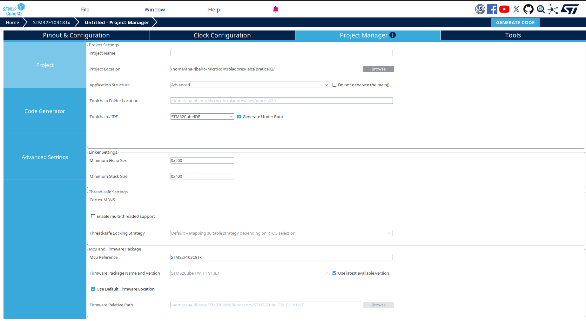

5. Após seguir esses passos na aba **Project Manager** clique na opçao que fica no carto superior esquerdo chamada **GENERATE CODE**


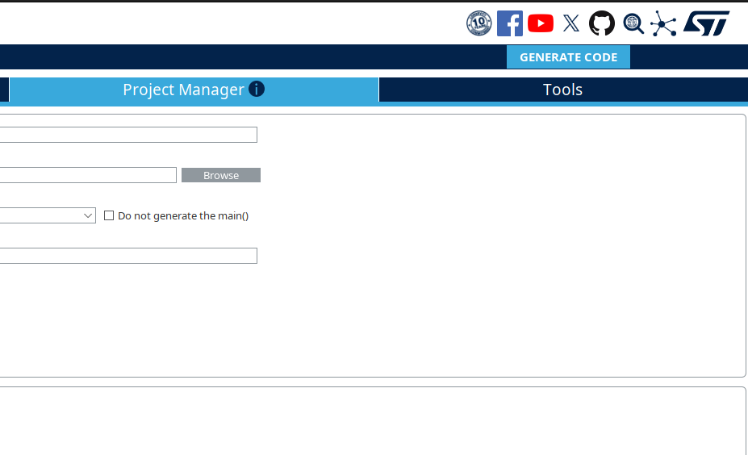

*Figura 6. Janela de geração automática do código do projeto.*

---

## Código do blink

Depois da geração do projeto, a estrutura básica do `main.c` já estará pronta. O projeto inicial chama funções como `HAL_Init()`, `SystemClock_Config()` e `MX_GPIO_Init()` antes de entrar no laço principal, deixando o `while (1)` como local natural para a lógica da aplicação. 

Nesse exemplo, o blink é implementado com `HAL_GPIO_TogglePin()` e `HAL_Delay(500)`. 

```c
while (1)
{
  HAL_GPIO_TogglePin(pinoLED_GPIO_Port, pinoLED_Pin);
  HAL_Delay(500);
}
```

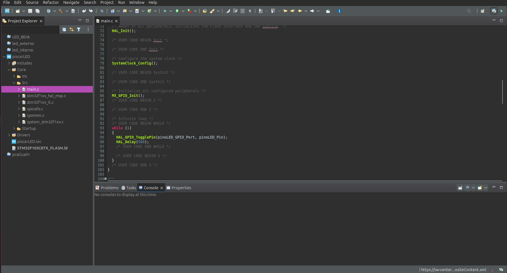

*Figura 7. Código do blink inserido no `while (1)` do arquivo `main.c`.*

---

## O que esse código faz

A função `HAL_GPIO_TogglePin()` alterna o estado lógico do pino configurado como saída. Já a função `HAL_Delay()` cria uma espera em milissegundos. O DeepBlueEmbedded usa exatamente essa ideia para demonstrar o controle de uma saída digital com a HAL. 

Nesse caso:

* `HAL_GPIO_TogglePin(...)` muda o estado atual do LED
* `HAL_Delay(500)` espera 500 ms
* o processo se repete continuamente dentro do `while (1)`

Assim, o LED pisca em intervalos regulares.

---

## Outra forma de fazer

Além de `HAL_GPIO_TogglePin()`, o DeepBlueEmbedded também mostra que o mesmo efeito pode ser obtido com `HAL_GPIO_WritePin()`, ligando e desligando o pino manualmente. 

```c
while (1)
{
  HAL_GPIO_WritePin(pinoLED_GPIO_Port, pinoLED_Pin, GPIO_PIN_SET);
  HAL_Delay(500);

  HAL_GPIO_WritePin(pinoLED_GPIO_Port, pinoLED_Pin, GPIO_PIN_RESET);
  HAL_Delay(500);
}
```

As duas abordagens servem para o mesmo objetivo. Para um primeiro teste, a versão com `HAL_GPIO_TogglePin()` costuma ser mais simples.

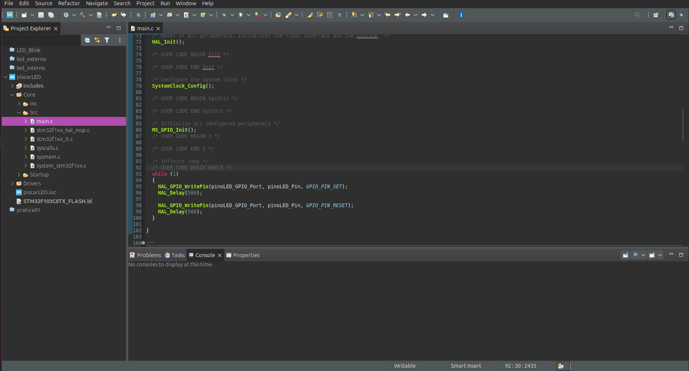

*Figura 8. Alternativa usando `HAL_GPIO_WritePin()` para controlar o LED.*

---

## Onde escrever esse código

Esse trecho deve ser colocado dentro da região reservada ao usuário no `while (1)`, respeitando as marcações `USER CODE BEGIN` e `USER CODE END`. 

```c
/* USER CODE BEGIN WHILE */
while (1)
{
  HAL_GPIO_TogglePin(pinoLED_GPIO_Port, pinoLED_Pin);
  HAL_Delay(500);
  /* USER CODE END WHILE */

  /* USER CODE BEGIN 3 */
}
```


---

## Código completo

Abaixo está um exemplo completo do trecho principal do `while (1)` utilizando `HAL_GPIO_TogglePin()`:

```c
/* USER CODE BEGIN WHILE */
while (1)
{
  HAL_GPIO_TogglePin(pinoLED_GPIO_Port, pinoLED_Pin);
  HAL_Delay(500);

  /* USER CODE END WHILE */

  /* USER CODE BEGIN 3 */
}
```

Caso prefira controlar manualmente os estados do LED, também é possível usar `HAL_GPIO_WritePin()`:

```c
/* USER CODE BEGIN WHILE */
while (1)
{
  HAL_GPIO_WritePin(pinoLED_GPIO_Port, pinoLED_Pin, GPIO_PIN_SET);
  HAL_Delay(500);

  HAL_GPIO_WritePin(pinoLED_GPIO_Port, pinoLED_Pin, GPIO_PIN_RESET);
  HAL_Delay(500);

  /* USER CODE END WHILE */

  /* USER CODE BEGIN 3 */
}
```

---

## Resultado esperado

Se tudo estiver configurado corretamente, após compilar, gravar e executar o projeto, o LED conectado ao **PC13** deverá alternar seu estado continuamente.

Esse é um dos testes mais importantes do início, porque confirma que:

* o projeto foi criado corretamente;
* o GPIO foi configurado como saída;
* a geração de código funcionou;
* a placa está executando o programa.


*Figura 10. Resultado esperado após a gravação do programa na placa.*

---

## Primeira execução e configuração de debug

Na primeira vez que o projeto for executado, a STM32CubeIDE pode abrir uma janela para criar uma configuração de debug. **Na versão 2.1.0 vai abrir uma janela com á seguir**


Normalmente, basta:

* Selecionar `STM32 Cortex-M C/C++ Application`
* Confirmar o arquivo `.elf` do projeto
* Escolher o programador conectado, como ST-Link
* Clicar em `Debug` ou `Run`

Depois da primeira configuração, a IDE costuma reutilizar essas opções automaticamente nas próximas execuções.


---

## Resumo

Neste exemplo, o CubeMX é usado para configurar o **PC13 como saída digital** e gerar a estrutura inicial do projeto. Depois, na IDE, o arquivo `main.c` recebe o código da aplicação que faz o LED piscar com `HAL_GPIO_TogglePin()` ou `HAL_GPIO_WritePin()`. Esse fluxo aparece nos dois materiais usados como base para esta página. 
