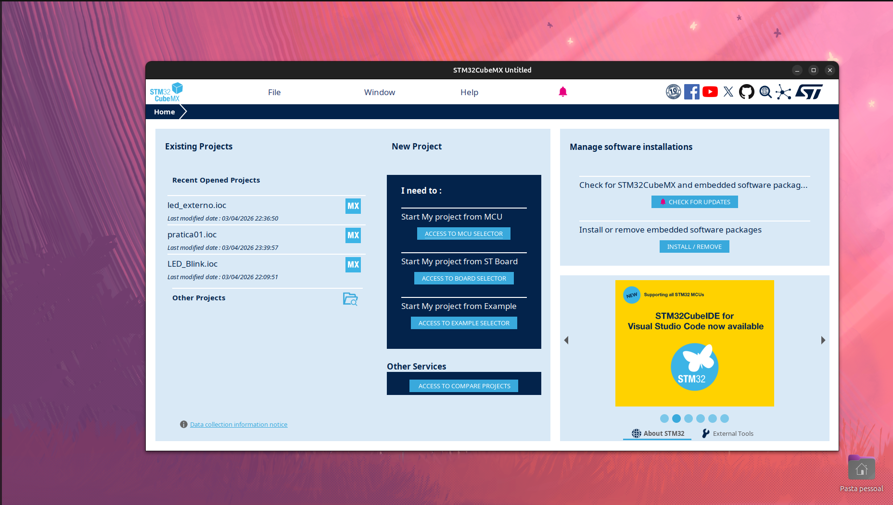

# Fluxo de Trabalho: Do CubeMX à IDE

Antes de começar a programar a STM32, é importante entender qual é o papel de cada software utilizado durante o desenvolvimento.

No fluxo básico com STM32, normalmente são usadas duas ferramentas principais:

* STM32CubeMX
* STM32CubeIDE

Cada uma possui uma função diferente.

---

## STM32CubeMX

O STM32CubeMX é a ferramenta utilizada para configurar o microcontrolador.

Nele, você escolhe:

* O modelo da placa ou microcontrolador
* Quais pinos serão usados
* Quais periféricos estarão ativos
* Configurações de clock
* Configurações de comunicação, como UART, SPI e I2C
* Timers, ADC, PWM e outros recursos

O CubeMX funciona como uma ferramenta gráfica de configuração.

Ao final, ele gera automaticamente a estrutura inicial do projeto, incluindo arquivos, bibliotecas e funções de inicialização.

Em outras palavras, o CubeMX é responsável por preparar o projeto antes da programação.

---

## STM32CubeIDE

A STM32CubeIDE é o ambiente onde o código será escrito.

Depois que o projeto é gerado no CubeMX, ele pode ser aberto na IDE.

Na STM32CubeIDE, você poderá:

* Escrever o código da aplicação
* Compilar o projeto
* Corrigir erros
* Gravar o programa na placa
* Fazer debug
* Acompanhar variáveis e execução do código

A IDE reúne editor de código, compilador, gravador e depurador em um único ambiente.

---

## Como as duas ferramentas trabalham juntas

O fluxo normalmente funciona desta forma:

1. Criar o projeto no STM32CubeMX
2. Configurar os pinos e periféricos
3. Gerar o código
4. Abrir o projeto na STM32CubeIDE
5. Escrever a lógica da aplicação
6. Compilar
7. Gravar na placa
8. Testar e depurar

---

## Diferença entre configuração e programação

No CubeMX, você configura o hardware do microcontrolador, definindo quais pinos e periféricos serão utilizados.

Na IDE, você escreve a lógica da aplicação, dizendo o que o microcontrolador deve fazer.

Por exemplo:

- CubeMX: configurar PC13 como saída
- IDE: escrever o código para acender e apagar o LED

---

## O que acontece quando o código é gerado

Quando o CubeMX gera o projeto, vários arquivos e pastas são criados automaticamente.

Os principais são:

- `Core/Inc`: arquivos de cabeçalho
- `Core/Src`: arquivos de código-fonte
- `Drivers`: bibliotecas da STM32
- `main.c`: arquivo principal da aplicação

No início, você usará principalmente o arquivo `main.c`, mas com o tempo aprenderá a trabalhar com outros arquivos do projeto.

---

## Exemplo prático

Imagine que você deseja fazer um LED piscar.

Nesse caso:

* No CubeMX, você configura o pino PC13 como saída
* O CubeMX gera o código inicial
* Na IDE, você escreve o código para alternar o estado do LED
* Depois, compila e grava na placa

Ou seja, o CubeMX prepara a estrutura e a IDE é usada para programar e executar o projeto.

---

## Resumo

De forma simplificada:

* CubeMX = configuração do hardware e geração automática do projeto
* STM32CubeIDE = escrita do código, compilação, gravação e debug

Entender a função de cada ferramenta ajuda bastante no início, porque evita confundir configuração de hardware com programação da aplicação.
