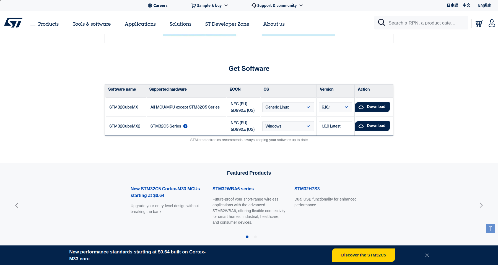
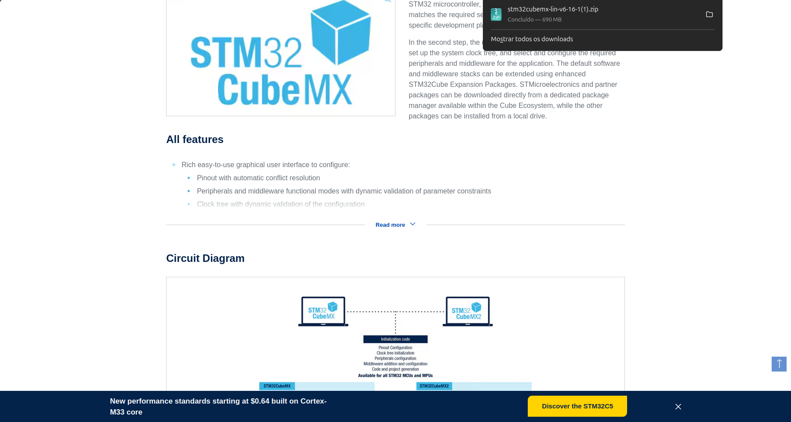

# 🛠️ STM32CubeMX: O Configurador Gráfico

O STM32CubeMX é a ferramenta essencial para quem trabalha com a arquitetura ARM da ST. Ele permite que você configure pinos, clocks e periféricos de forma visual, gerando o código de inicialização automaticamente.

Existem duas formas de utilizá-lo:

1. Integrado: Já vem dentro do STM32CubeIDE (abre automaticamente ao clicar em arquivos .ioc).
2. Standalone (Avulso): Uma ferramenta separada, ideal para quem quer apenas planejar o hardware ou usar compiladores diferentes.


---

#    Download

1. Acesse o site: [STM32CubeMX Official Page.](https://www.st.com/en/development-tools/stm32cubemx.html?dl=redirect)
2. Get Software: Escolha a opção STM32CubeMX (Linux).



3. E-mail: Assim como na IDE, você receberá um link de download por e-mail após preencher os dados de convidado.





---

#  Instalação no Ubuntu

O instalador do CubeMX para Linux é um pouco diferente (ele usa Java). Siga estes comandos no terminal:
Extrair e Preparar

```
cd ~/Downloads
unzip en.stm32cubemx-lin-v*.zip
chmod +x SetupSTM32CubeMX-*.linux

```
